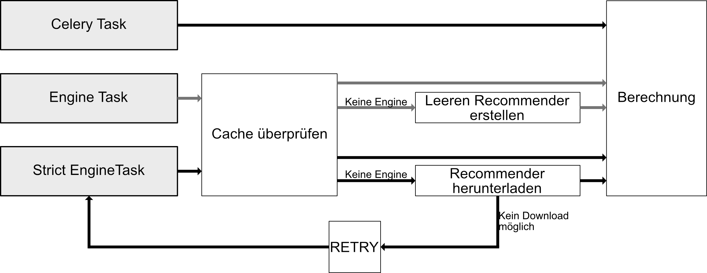

# AI-Backend Dokumentation
Das AI-Backend ist in zwei zentrale Teile unterteilt: Die API, die Anfragen der Web-Scraper und des Backends entgegennimmt und Celery-Worker, die die Aufgaben ausführen. Diese beiden Teile kommunizieren miteinander, indem Nachrichten mittels RabbitMQ an die Celery-Worker gesendet und mittels Redis die Resultate davon an die API übertragen werden. Das AI-Backend ist so aufgebaut, dass es jeweils eine API, RabbitMQ und Redis Instanz gibt, wobei theoretisch mehrere Worker in einem Pool Aufgaben erledigen können. Hierbei ist zu beachten, dass pro Maschine nur ein Worker laufen sollte (siehe Celery Dokumentation bezüglich Concurrency).

## RabbitMQ
Es sind zwei Message Queues in RabbitMQ für das AI-Backend reserviert. Normale Nachrichten werden standardmäßig über „ml_celery“ gesendet und dann von einem Subprozess eines Workers aufgenommen. „ml_bradcast“ ist ein Bradcast Exchange, dessen Nachrichten von den Hauptprozessen aller Worker aufgenommen werden. Diese Queue sollte also für Nachrichten genutzt werden, die alle Worker-Maschinen verarbeiten müssen.

## API/Worker Ablauf
Der normale Ablauf zum Verarbeiten einer API Request ist folgender: Die API erhält http Request eine Aufgabe und erstellt daraus ein Celery AsyncResult. Je nach Aufgabe werden hiervor Aspekte des Inputs validiert. Mit der Erstellung des Result-Objects wird automatisch eine Message für die entsprechende Task in an definierte Queue gesendet. Die API wartet nun threadsafe mittels Polling auf das Resultat des Result-Objects (die API ist währenddessen nicht blockiert und kann weitere Aufgaben annehmen). Parallel dazu entnimmt ein Worker die Message aus der Queue und startet in einem seiner Subprozesse die dazu reservierte Task. Je nach Task-Art werden hier vor der eigentlichen Berechnung der Task validierungsschritte durchgeführt (z.B. das benötigte Recommender-Objekt, das die Vektordatenbank und SentenceTransformer enthält, wird im Cache aktualisiert; siehe [Task Aufbau](task_overview.png)). Nachdem die Task im Worker abgeschlossen wurde (erfolgreich oder durch eine Exception) wird das Ergebnis in Redis geschrieben, was das AsyncResult-Objekt in der API aktualisiert. Das Resultat kann nun von der API zurückgegeben werden. Dieser Prozess ist hier nochmal visualisiert:

## Task Aufbau
Eine Task des Workers ist einem dieser drei Typen zugeordnet. Celery Task ist die Standard-Task und beginnt sofort mit der Berechnung/Ausführung der Task. (Strict)Engine Tasks haben einen "before_start"-Prozess, welcher dafür sorgt, dass eine Recommendation Engine vorhanden ist: 

## Engine Update
Da ja nicht jeder Worker seine eigene Vektordatenbank (Annoy Mapping) bauen sollte (sehr ineffizient), jeder Worker jedoch eine (halbwegs) aktuelle Version der Vektordatenbank benötigt, muss ein Update und Sync-Prozess durch die Komponenten abgebildet werden. Hierfür wird die API als Datenspeicher „missbraucht“. Wird build_annoy über die API aufgerufen, wird die ebenso benannte Task an einen Worker gesendet (über RabbitMQ). Die Task erfragt dann alle Daten aus dem Backend und baut eine neue Vektordatenbank. Diese wird temporär gespeichert und als zip-Archiv verpackt. Das Archiv wird dann bei der API hochgeladen. Immer wenn die API ein neues Recommender-Engine-Archiv erhält, ersetzt sie das alte Archiv durch das Neue und sendet ein Update-Signale über „ml_braodcast“ an alle Worker. Die buid_annoy Task ist mit dem Upload und dem anschließenden Löschen des temporären Archivs abgeschlossen. Durch das Update-Signal überprüfen nun alle Worker, wie alt die Recommender-Engine in deren Caches sind und vergleichen dies mit dem Erstellungszeitpunkt, der mit dem Update-Signal mitgegeben wurde (jeder Worker schaut also: Ist der Recommender, den ich habe, älter als der Recommender, der die API hat). Sollte der Recommender im Cache älter sein, lädt dieser Worker den neuen Recommender von der API herunter und entpackt das Archiv. Bei Aufrufen einer Task, die einen Recommender benötigt, wird dieser Recommender beim validieren des Caches feststellen, dass der Recommender im Cache älter ist, als der im Speicher (auf der Festplatte) und den Cache aktualisieren. Dieses Prinzip sorgt dafür, dass nur ein Worker die aufwändige Task build_annoy ausführen muss, jedoch mehrere Worker auf verschiedenen Maschinen die selber Recommender-Engine im Cache geladen haben.

## Recommendation Engine
Ein Recommender-Objekt oder hier auch häufig Engine genannt, verwaltet die Vektordatenbank mit den Sätzen der gespeicherten Publikationen, sowie jeglichen Code, der zum Generieren von Recommendations benötigt wird. Im Prinzip gehört Alles, was PyTorch verwendet hierein. 

## Deployment
Um das AI-Backend zu starten, muss einfach nur das Docker-Compose-File gebaut werden und eine valide Version der .env-Datei vorhanden sein. Für das AI-Backend müssen die Container rabbitmq, celery_worker, ai_backend und redis starten. Der backend_flower Container startet eine hilfreiche WebUI um laufende Worker zu überwachen, ist jedoch nicht benötigt. Wenn das ai_backend (die API) und der celery_worker starten, bauen sie automatisch die benötigten Ordnerstrukturen in Code-Ordner der Container. Für die API kann außerdem eine Start-Engine über die .env-Dateien angegeben werden. Sollte diese Engine in der Ordner-Struktur vorhanden sein, wird nicht automatisch beim Start der API build_annoy ausgeführt. Ob die API und der Worker laufen kann über die SwaggerUI (WebUI) unter localhost:<ai_backend_host>/docs gut überprüft werden. Dort kann eine Anfrage per Knopfdruck an die API gesendet und das Resultat ausgelesen werden

## Weitere Hilfe
Folgende Links sind sehr hilfereich beim Einlesen in die AI-Backend Codebase (viel Glück):
https://fastapi.tiangolo.com/tutorial/first-steps/
https://fastapi.tiangolo.com/tutorial/path-params/
https://fastapi.tiangolo.com/tutorial/query-params/
https://fastapi.tiangolo.com/tutorial/response-model/
https://fastapi.tiangolo.com/tutorial/request-files/ 
https://fastapi.tiangolo.com/async/?h=concurrency

https://docs.celeryq.dev/en/stable/userguide/workers.html
https://docs.celeryq.dev/en/stable/userguide/tasks.html
https://docs.celeryq.dev/en/stable/getting-started/first-steps-with-celery.html
https://docs.celeryq.dev/en/stable/userguide/configuration.html
