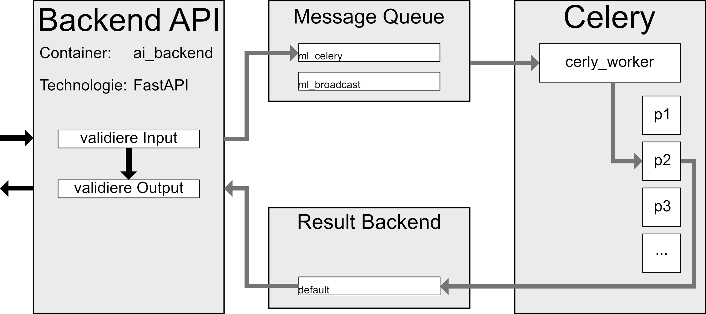

# AI-Backend Dokumentation
Das AI-Backend ist in zwei zentrale Teile unterteilt: Die API, die Anfragen der Web-Scraper und des Backends entgegennimmt und Celery-Worker, die die Aufgaben ausführen. Diese beiden Teile kommunizieren miteinander, indem Nachrichten mittels RabbitMQ an die Celery-Worker gesendet und mittels Redis die Resultate davon an die API übertragen werden. Das AI-Backend ist so aufgebaut, dass es jeweils eine API, RabbitMQ und Redis Instanz gibt, wobei theoretisch mehrere Worker in einem Pool Aufgaben erledigen können. Hierbei ist zu beachten, dass pro Maschine nur ein Worker laufen sollte (siehe Celery Dokumentation bezüglich Concurrency).

## RabbitMQ
Es sind zwei Message Queues in RabbitMQ für das AI-Backend reserviert. Normale Nachrichten werden standardmäßig über „ml_celery“ gesendet und dann von einem Subprozess eines Workers aufgenommen. „ml_bradcast“ ist ein Bradcast Exchange, dessen Nachrichten von den Hauptprozessen aller Worker aufgenommen werden. Diese Queue sollte also für Nachrichten genutzt werden, die alle Worker-Maschinen verarbeiten müssen.

## API/Worker Ablauf
Der normale Ablauf zum Verarbeiten einer API Request ist folgender: Die API erhält über http Request eine Aufgabe und erstellt daraus ein Celery AsyncResult. Je nach Aufgabe werden hiervor Aspekte des Inputs validiert. Mit der Erstellung des Result-Objects wird automatisch eine Message für die entsprechende Task an die definierte Queue gesendet. Die API wartet nun threadsafe mittels Polling auf das Resultat des Result-Objects (die API ist währenddessen nicht blockiert und kann weitere Aufgaben annehmen). Parallel dazu entnimmt ein Worker die Message aus der Queue und startet in einem seiner Subprozesse die dazu reservierte Task. Je nach Task-Art werden hier vor der eigentlichen Berechnung der Task validierungsschritte durchgeführt (z.B. Version des vorliegenden SentenceTransformers überprüfen und das Modell ggf. aktualisieren). Nachdem die Task im Worker abgeschlossen wurde (erfolgreich oder durch eine Exception) wird das Ergebnis in Redis geschrieben, was das AsyncResult-Objekt in der API aktualisiert. Das Resultat kann nun von der API zurückgegeben werden. Dieser Prozess ist hier nochmal visualisiert:

## Fundamental Funktionalität (was gehört in die Celery Worker)
Das Grundprinzip hinter der Empfehlungsgenerierung ist eigentlich recht simpel: Es werden Sentence Transformer genutzt, um Sätze in Vektoren zu konvertieren. Sentence Transformer funktionieren dabei so, dass ähnliche Satze auch in ähnlichen Vektoren resultieren. Man stelle sich diese Vektoren als Punkte in einem mehrdimensionalen Raum vor. Die Positionen von ähnlichen Sätzen sind dann räumlich nah zueinander. Eine Empfehlung kann aufgrund dieses Prinzips folgendermaßen entstehen:  
1. Es werden die wichtigsten Sätze eines Papers extrahiert und als Vektoren gespeichert.
2. Die Suchanfrage des Nutzers wird außerdem als Vektor gespeichert.
3. Es wird geschaut, was die nächsten gespeicherten Positionen (nearest neighbors) zu der Position der Suchanfrage sind.
4. Die x nächsten Nachbarn sind dann die x ähnlichsten Paper zu der Suchanfrage.

Bei diesem konzeptionellen Ablauf zu bestimmen, was Aufgaben des AI-Backends und des "normalen" Backends sind, ist schwammig. Grundlegend kann gesagt werden, dass Aufgaben, die über das Sammeln und Aggregieren von Daten hinausgehen, sollten, sofern möglich, dem AI-Backend zugeordnet werden. Eine solche Trennung soll erreichen, dass der Betrieb der gesamten Software in Zunkunft günstiger ist, da beispielsweise an Stelle einer Maschine mit viel Speicher und Rechenleistung (wenn das Backend sowohl Daten speichert und KI-Modell berechnet) zwei Maschinen, eine mit mehr Rechnenleistung und eine mit mehr Speicher genutzt werden können. Die Trennung ergibt zusätzlich den Vorteil, dass in den verschiedenen Komponenten unterschiedliche Programmiersprachen, abhängig der benötigten Features, genutzt werden können.  

Eine einfache Faustregel für diese Trennung ist: Wenn eine Aufgabe ein Modell oder Verfahren benutzt, dass durch Bibliotheken wie PyTorch, TensorFlow oder SciKit-Learn umgesetzt wird, besteht eine Argumentationsgrundlage es dem AI-Backend zuzuordnen. Eine wichtige und klaren Begrenzung hierfür ist jedoch: Das AI-Backend sollte nicht von sich aus Daten bei anderen Komponenten erfragen. Alle für das AI-Backend benötigten Daten sollten stets über die API bereitstellbar sein. Dies hat A den technischen Grund, dass das benutzte Framework Celery Probleme mit dem Herunterladen von Daten während des Aufgabenprozesses hat und B den konzeptionellen Grund, dass das AI-Backend keinen Zustand (stateless) haben sollte.

## Task Aufbau
Eine Celery Task im Worker kann verschiedenen Typen zugeordnet werden. Die Typen werden bestimmt durch die Python Klasse, an die die Task "gebunden" (siehe Celery Dokumentation zu 'bind') ist. Für diese verschiedenen Typen gibt es meist zwei Hauptgründe:
1. Der Aufgabenprozess ist atomar. Bedeutet, während eine Aufgabe von diesem Typ ausgeführt wird, sollte der Worker keine weitere Instanz der Aufgabe ausführen. 
2. Die Aufgabe hat einen Cache, der Prozessübergreifend genutzt wird.

Als Beispiel: Alle Aufgaben, die eine Instanz der Summarizer Klasse benötigen, teilen sich diese Instanz, damit der darin enthaltenden Sentence Transformer nicht mehrfach heruntergeladen wird. Diese Aufgabeninstanzen teilen sich also einen Cache.

## Recommendation Engine
Ein Recommender-Objekt oder hier auch häufig Engine genannt, beinhaltet die tatsächlichen logischen Operationen für die Daten. Die Engine liefert verschiedenen Prozeduren für den Celery Worker und definiert der Summarizer Objekt, welches von den Aufgaben genutzt wird. Es kann einen Text oder eine Serie an Texten bestehend aus jeweils einzelnen oder mehreren Sätzen zu Vektoren konvertieren. Diese Vektoren nach dem LexRank Algorithmus, also der Wichtigkeit der Sätze, ordnen und dann die n wichtigsten Sätze mit den dazugehörigen Vektoren zurückgeben.

## Deployment
Um das AI-Backend zu starten, muss einfach nur das Docker-Compose-File gebaut werden und eine valide Version der .env-Datei vorhanden sein. Für das AI-Backend müssen die Container rabbitmq, celery_worker, ai_backend und redis starten. Der backend_flower Container startet eine hilfreiche WebUI um laufende Worker zu überwachen, ist jedoch nicht benötigt. Wenn das ai_backend (die API) und der celery_worker starten, bauen sie automatisch die benötigten Ordnerstrukturen in Code-Ordner der Container. Für die API kann außerdem eine Start-Engine über die .env-Dateien angegeben werden. Sollte diese Engine in der Ordner-Struktur vorhanden sein, wird nicht automatisch beim Start der API build_annoy ausgeführt. Ob die API und der Worker laufen kann über die SwaggerUI (WebUI) unter localhost:<ai_backend_host>/docs gut überprüft werden. Dort kann eine Anfrage per Knopfdruck an die API gesendet und das Resultat ausgelesen werden

## Weitere Hilfe
Folgende Links sind sehr hilfereich beim Einlesen in die AI-Backend Codebase (viel Glück):
https://fastapi.tiangolo.com/tutorial/first-steps/
https://fastapi.tiangolo.com/tutorial/path-params/
https://fastapi.tiangolo.com/tutorial/query-params/
https://fastapi.tiangolo.com/tutorial/response-model/
https://fastapi.tiangolo.com/tutorial/request-files/ 
https://fastapi.tiangolo.com/async/?h=concurrency

https://docs.celeryq.dev/en/stable/userguide/workers.html
https://docs.celeryq.dev/en/stable/userguide/tasks.html
https://docs.celeryq.dev/en/stable/getting-started/first-steps-with-celery.html
https://docs.celeryq.dev/en/stable/userguide/configuration.html

## TODO: Gütekriterien für Empfehlungen
Um zukünftige Änderungen an den genutzten Empfehlungsverfahren mit dem aktuellen Verfahren zu vergleichen, ist eine Methodik zum Quantifizieren der Empfehlungs-Genauigkeit benötigt. Dies ist ein nicht-triviales Problem, da wenig Daten, die sich hierfür als Label nutzen lassen, von uns bekannt sind. Die Strategie, die in diesem Semester konzeptioniert wurde, basiert auf Triplet Datasets. In diesem Triplet Dataset wird ein Anker-Paper zufällig ausgewählt, sowie ein negativ Paper, von dem zu erwarten ist, dass es nicht ähnlich zu dem Anker ist und ein positiv Paper, von dem eine gewisse Ähnlichkeit zum Anker-Paper zu erwarten ist. Dann wird die geringste Distanz des Anker-Papers zu den negativ und positiv Papern berechnet. Dafür werden alle zu den drei Papern gespeicherten Vektoren gesammelt und der (z.B.) euklidische Abstand von allen Anker-Vektoren zu allen positiv Vektoren berechnet. Das Minimum dieser Abstände ist dann der geringste Abstand vom Anker-Paper zum positiv Paper. Dasselbe wird für das negativ Paper wiederholt. Es wird dann geprüft, ob der Abstand zum negativ Paper größer ist als der Abstand zum positiv Paper. Wenn ja, gilt dieses Triplet als erfolgreich. Das Verfahren wird für einen großen Teil des Datensatzes wiederholt und die Erfolgsrate wird berechnet. Diese Quote sagt dann aus, wie hoch die Wahrscheinlichkeit ist, dass das Empfehlungssystem ähnliche Paper vorzüglich zu unähnlichen Paper vorschlägt.

Dieses Verfahren ist zunächst recht simpel, doch fußt auf der Annahme, dass bereits bekannt ist, welche Paper zueinander "eine gewisse Ähnlichkeit" aufweisen. Die eigentliche Tücke besteht darin, dies unabhängig der generierten Vektoren zu bestimmen. Hierfür gibt es verschiedene Strategien, die ausprobiert werden können:
1. Paper-Ähnlichkeit basierend auf gleichen Autoren: Es ist zu erwarten, dass ein Paper ähnlicher zu einem anderen Paper mit einer Schnittmenge der Autoren ist, als zu einem Paper mit völlig unterschiedlichen Autoren. Die Autoren der von uns gespeicherten Paper sind bekannt, daher könnte so ein Triplet Dataset gebaut werden.
2. Arxiv Kategorie: Über die Web-Scraper kann die Arxiv Kategorie der Paper entnommen werden. Paper in derselben Kategorie sollten ähnlicher zueinander als zu Papern außerhalb der Kategorie sein. Hier ist jedoch zu beachten, dass die Arxiv Kategorien äußerst grob gefasst sind, und zu erwarten ist, dass Paper in derselben Kategorie trotzdem recht geringe Ähnlichkeit aufweisen.
3. TF-IDF Vektoren: Die TF-IDF Vektoren können für die Paper berechnet werden und basierend auf der Kosinusähnlichkeit dieser Vektoren kann ein Triplet Dataset gebaut werden. Paper mit hoher Kosinusähnlichkeit sind wahrscheinlich ähnlicher zueinander als zu Papern mit geringer Kosinusähnlichkeit.
4. Basierend auf Nutzerpräferenzen: Sobald Nutzer-Daten für die Software vorliegen, können diese genutzt werden, um Triplets zu bauen. Paper, die von denselben Nutzern gelesen/gemocht werden oder in denselben nutzergenerierten Gruppen vorkommen sollte ähnlicher zueinander als zu anderen Papern sein.

Diese Verfahren bieten eine gute Möglichkeit mit geringem Labeling-Aufwand die Güte des Empfehlungssystems zu bewerten. Leider bleibt es jedoch dabei, dass besonders ohne granularere Kategorisierung oder nutzergenerierten Daten das darauf aufbauende System nicht immer eine 100% korrekte Einschätzung des Systems vornehmen werden kann. Bei der Beurteilung sollte diese Ungewissheit also stets beachtet werden. Es ist außerdem zu empfehlen, fehlgeschlagenen Triplets zu überprüfen und zu checken, ob es sich tatsächlich um eine Fehleinschätzung des Empfehlungssystems handelt. Die daraus gewonnen Informationen können viele Aufschlüsse über die Empfehlungsgenauigkeit liefern.