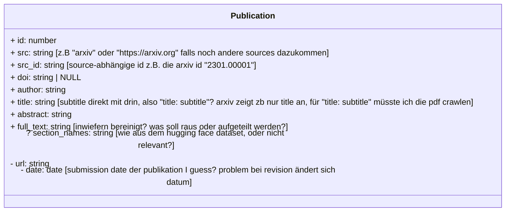
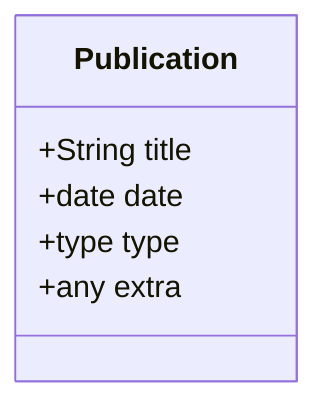

## Publication Dataset Aquisition
### TODO
+ WELCHE DATEN GENAU SOLLEN FÜR DEN ARXIV DATENSATZ GECRAWLT WERDEN
+ web crawler ueber arxiv
	+ bisher sämtliche publikations ids von 2023 bis 2017 ermittelt: 
		- soll bei der menge erstmal auf eine kategorie (z.B nur cs?) beschränkt werden oder sollen einfach alle publikationen gecrawlt werden
	+ publikationsdaten wie doi, autor, abstract, und pdf text werden jetzt über bisher ermittelte arxiv ids abgerufen
		- welche form soll datensatz haben: der arxiv datensatz von hugging face hat ja article, abstract, section_names
			- umgesetzt habe ich jetzt id,src,src_id,doi,author,title,abstract,full_text
			- aus team_datenbank entnommen
				- kompletten Autorennamen als string
				- publications: doi, url (ich hab da noch src als quelle genommen zb arxiv falls da noch andere quellen dazukommen, und die src_id also die id die die publikation von ihrer quelle hat also arxiv_id)
	- inwie weit sollen pdf inhalte bereinigt und aufgeteilt werden
		- wie wird mit math formeln im text umgegangen
		- besserer pdf 
		
	- dann fehlt nur noch cronjob+celery
### Bisher ermittelte Arxiv-IDs (über alle Kategorien)
- 2017: 111.823
- 2018: 120.037
- 2019: 130.429
- 2020: 142.253
- 2021: 137.706
- 2022: 138.386
- 2023: 120.287
- **Gesamt (2017-2023): 900.921**
### Welche Daten als Datensatz speichern/abrufen?
- \+ heißt umgesetzt, \- heißt noch nicht umgesetzt, \? heißt soll das umgesetzt werden?

### Vergleich Publication aus Database
