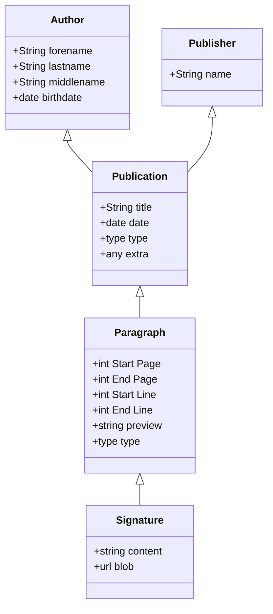
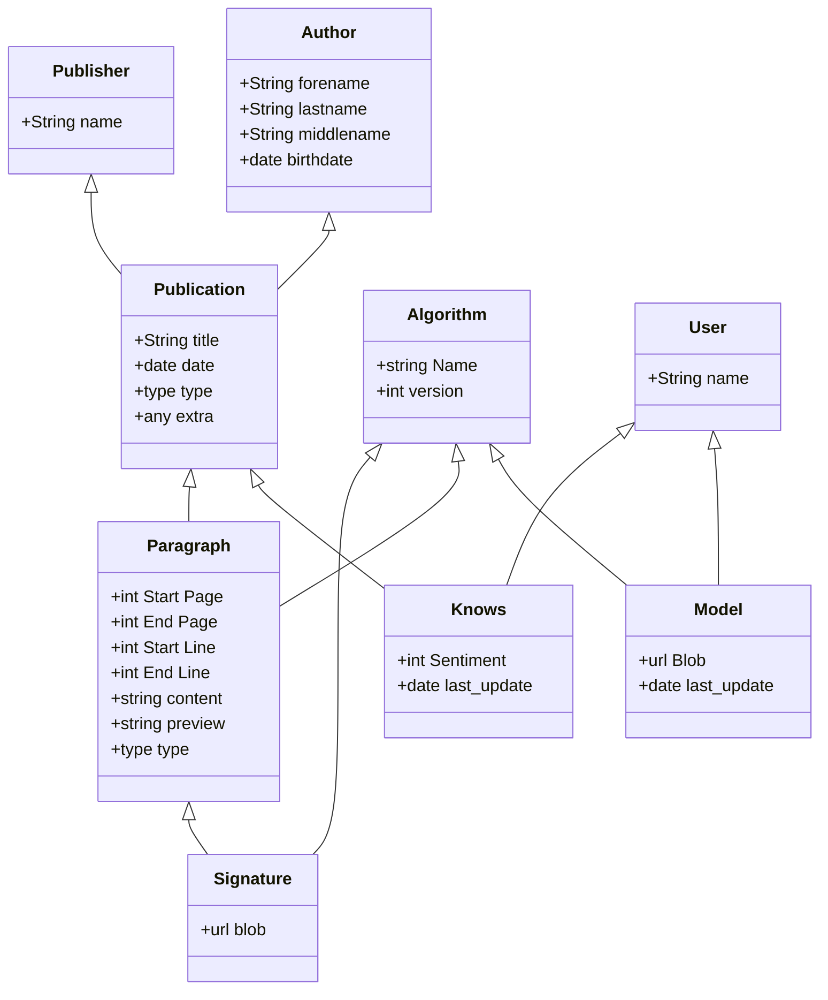

## Database Architecture - First Iteration

```mermaid
classDiagram
  class Author {
    +String forename
    +String lastname
    +String middlename
    +date birthdate
  }
  class Publisher {
    +String name
  }
  class Publication {
    +String title
    +date date
    +type type
    +any extra
  }
  class Paragraph {
    +int Start Page
    +int End Page
    +int Start Line
    +int End Line
    +string preview
    +type type 
  }
  class Signature {
    +string content
    +url blob
  }
  Author <|-- Publication
  Publisher <|-- Publication
  Publication <|-- Paragraph
  Paragraph <|-- Signature
```
---
## Database Architecture - Second Iteration

```mermaid
classDiagram
    class Author {
      +String forename
      +String lastname
      +String middlename
      +date birthdate
    }
    class Publisher {
      +String name
    }
    class Publication {
      +String title
      +date date
      +type type
      +any extra
    }
    class Paragraph {
      +int Start Page
      +int End Page
      +int Start Line
      +int End Line
      +string content
      +string preview
      +type type 
    }
    class Signature {
      +url blob
    }
    class Algorithm {
      +string Name
      +int version
    }
    class Model {
      +url Blob
      +date last_update
    }
    class User {
      +String name
    }
    class Knows {
      +int Sentiment
      +date last_update
    }
    Publication <|-- Knows
    User  <|-- Model
    Algorithm  <|-- Model
    User  <|-- Knows
    Algorithm <|-- Paragraph
    Algorithm <|-- Signature
    Author <|-- Publication
    Publisher <|-- Publication
    Publication <|-- Paragraph
    Paragraph <|-- Signature

```